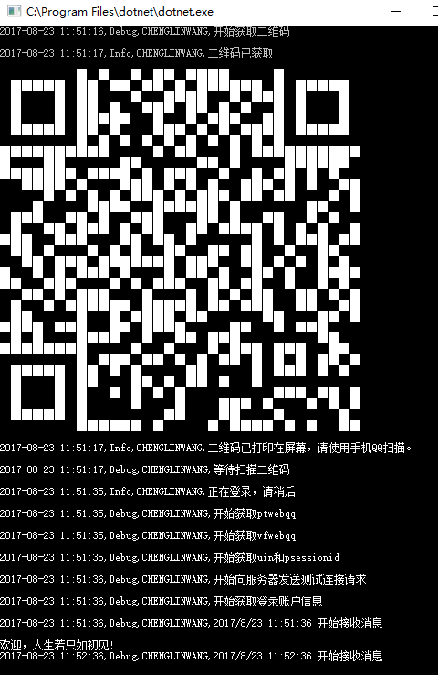

# SmartQQ  
## 采用.NET CORE可运行在 Linux 、 Windows 和 Mac OSX 平台下。

# 效果如下图:
<div align="center">

</div>

-----------------
| **`Linux CPU`** | **`Linux GPU`** | **`Mac OS CPU`** | **`Windows CPU`** | **`Android`** |
|-----------------|---------------------|------------------|-------------------|---------------|
| [](https://github.com/WangCharlie/SmartQQ) | [](https://github.com/WangCharlie/SmartQQ) | [](https://github.com/WangCharlie/SmartQQ) | [](https://github.com/WangCharlie/SmartQQ) | [](https://github.com/WangCharlie/SmartQQ) |

# 调用代码
```
 SmartQQClient
                // 登录
                .Login((bytes) =>
                {
                    using (var ms = new MemoryStream(bytes))
                    {
                        SmartQQClient.ConsoleWriteImage(new Bitmap(Image.FromStream(ms)));
                        Logger.Instance.Info("二维码已打印在屏幕，请使用手机QQ扫描。");
                    }
                })
                // 好友消息回调
                .ReceivedFriendMessage((message) => {
                    message.Reply("test");
                    Logger.Instance.Info($"{message.Sender.Alias ?? message.Sender.Nickname}:{message.Content}");
                })
                // 群消息回调
                .ReceivedGroupMessage((message) => {
                    Logger.Instance.Info(
                    $"[{message.Group.Name}]{message.Sender.Alias ?? message.Sender.Nickname}:{message.Content}");
                    if (message.Content.IsMatch(@"^\s*Knock knock\s*$"))
                        message.Reply("Who's there?");
                    else if (message.StrictlyMentionedMe)
                        message.Reply("什么事？");
                })
                // 讨论组消息回调
                .ReceivedDiscussionMessage((message) =>
                {
                    Logger.Instance.Info($"[{message.Discussion.Name}]{message.Sender.Nickname}:{message.Content}");
                })
                // 消息回显
                .ReceivedMessageEchoEventArgs((e) => {
                    Logger.Instance.Info($"{e.Target.Name}>{e.Content}");
                })
                //开始服务
                .Start((client) => {
                    Logger.Instance.Info($"欢迎，{client.Nickname}!");
                });

            Console.ReadLine();
```
